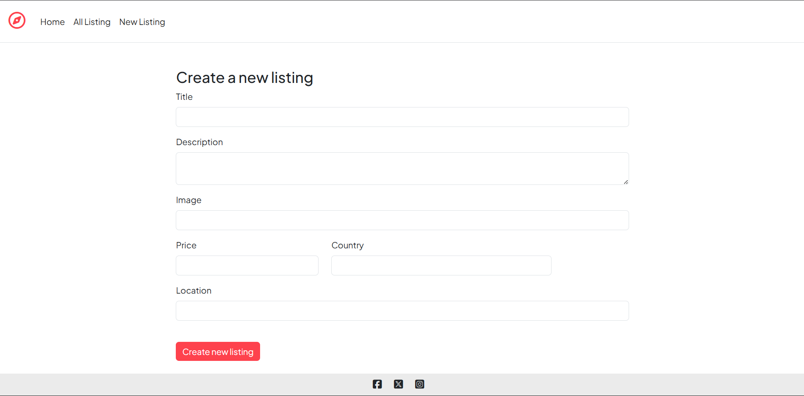
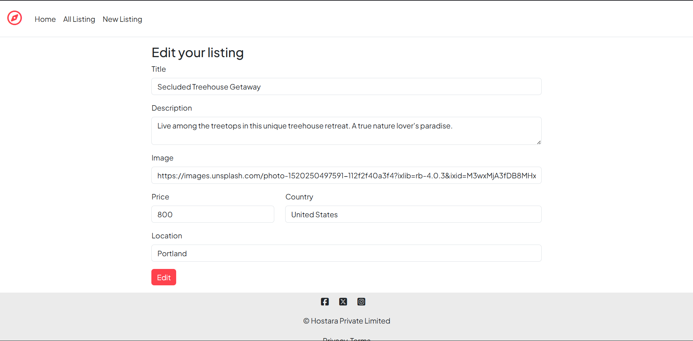
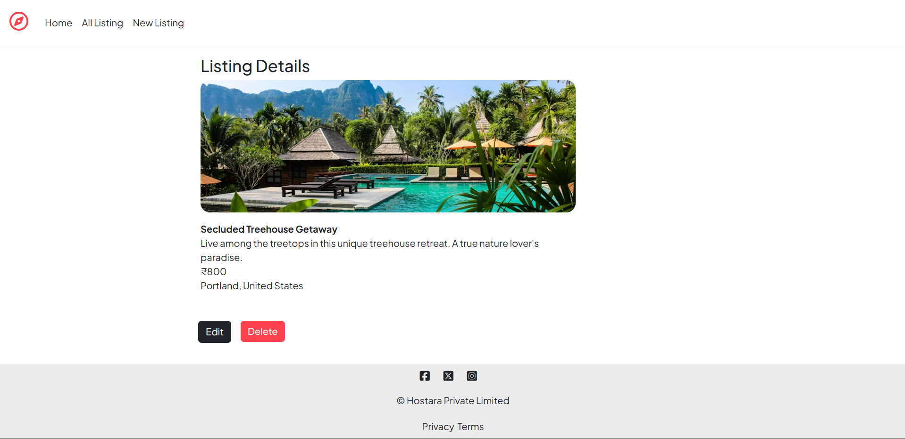

# 🏡 Hostara

## 📌 Description

**Hostara** is a full-stack Airbnb-style web application that allows users to create, explore, update, and delete property listings. It provides a simple and intuitive platform for hosts to share their spaces and for travelers to discover unique stays.

---

## 🚀 Features

* Create new property listings
* View all available listings
* Update listing details
* Delete listings
* Clean and user-friendly interface
* Server-side rendering using EJS

---

## 🛠️ Technologies Used

* **Frontend:** HTML, CSS, JavaScript
* **Backend:** Node.js, Express.js
* **Templating Engine:** EJS
* **Database:** MongoDB

---

## 📷 Images

* Listing Details Page
  

* Create Listing Page
  

* Edit Listing Page
  

* Show Listing Page
  

---

## 💡 Usage

* Browse available property listings on the homepage
* Click on a listing to view full details
* Add new listings using the “Create” option
* Edit or delete listings as needed

---

## 📄 License

This project is licensed under the **MIT License**.

---

## 📬 Contact

For questions or suggestions, feel free to open an issue in the repository.

---
